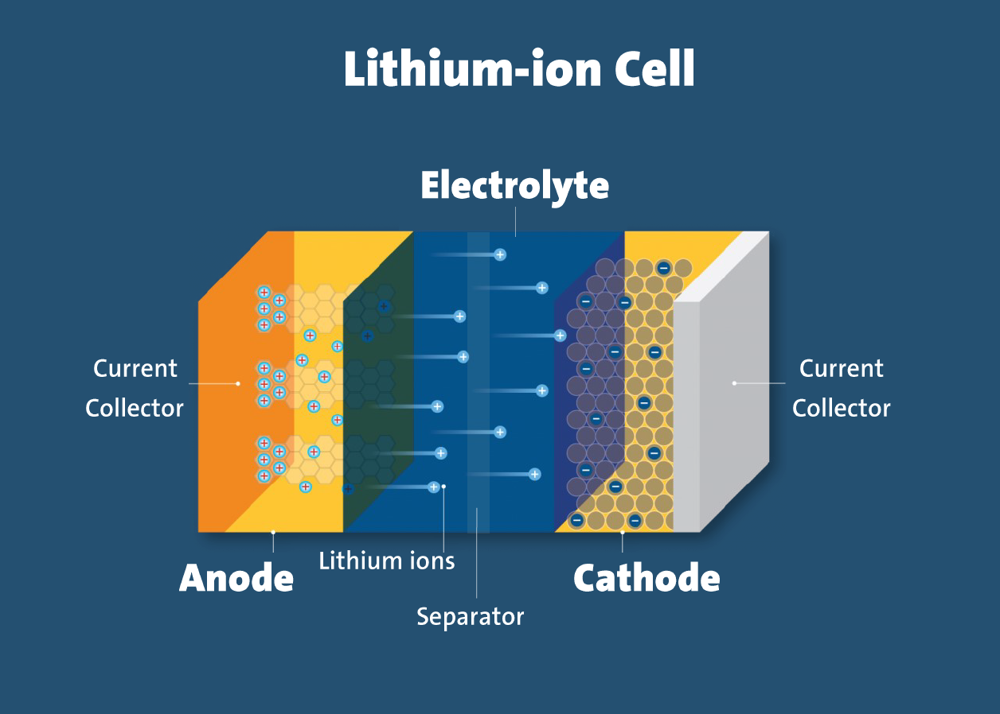

# About Me

My name is Guy, and I am a master's student in the Weizmann Institute of Science.
I do my research in the group of [Michal Leskes](https://www.weizmann.ac.il/MCMS/Leskes/home), in the Department of Molecular Chemistry and Materials Science in the Faculty of Chemistry.

The research is about failure mechanisms of lithium batteries and the magentic resonance techniques that can be used in order to study them.

